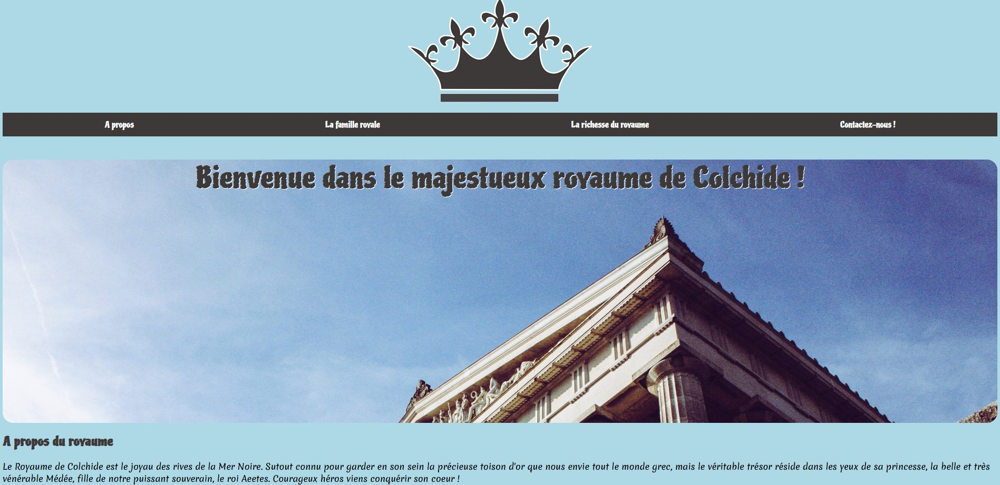
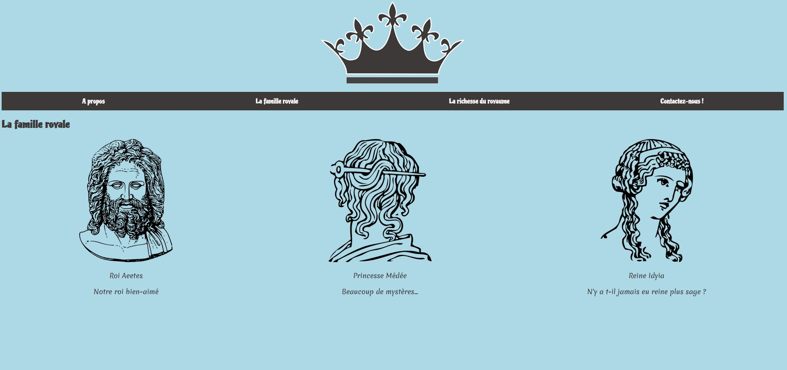
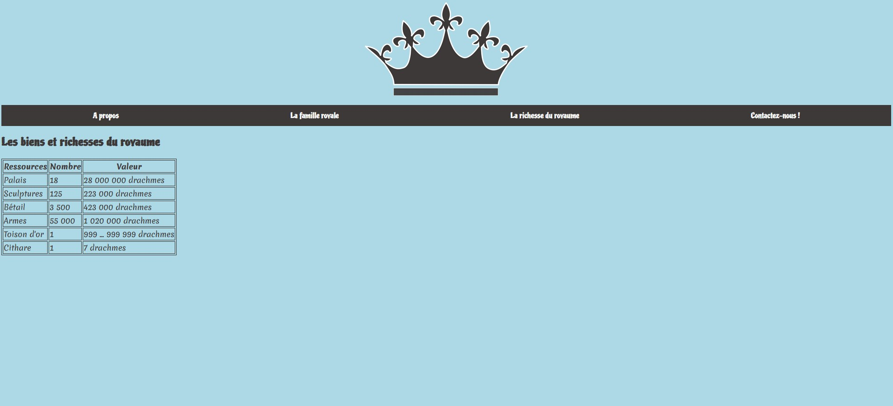
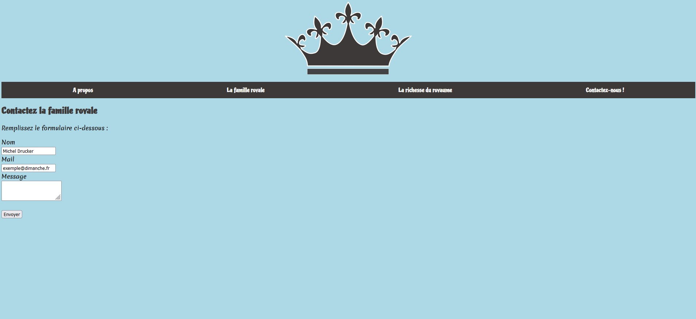

# Colchis_kingdom
WSC PROJECT [Admission test]

This mini project was released as technical test for being admited at Wild Code School. It was my very first website in HTML.

## Tech Challenge (#dev)

**Le défi technique**

C'est à vous de personnaliser votre site web.
Nous ne mettrons pas l'accent sur le design, c’est votre capacité d'apprentissage du HTML et du CSS qui sera jugée. Vous n'êtes pas obligé d'ajouter du JavaScript, mais nous vous encourageons à le faire !

**Fonctionnalités à inclure dans votre site web :**

* Une barre de navigation sur chaque page, structurée comme une liste utilisant les balises ul et li, liée aux pages pertinentes de votre site web

* Une section "héros" sur la page d'accueil (index.html) affichant une rubrique accueillant les utilisateurs sur le site (essayez d'inclure une image de fond CSS ou une couleur de fond)

* Une page "Famille royale", affichant les trois membres principaux de la famille royale, placés côte à côte (Conseil : essayez d'utiliser Flexbox pour le positionnement)

* Un tableau HTML présentant les biens royaux du royaume ou un calendrier des événements sportifs royaux (Vous êtes libre d'être créatif ici !)

* Une page de contact avec un formulaire (pour contacter le royaume) avec des <label> explicites (Conseil : utilisez l'attribut "for" de l'élément label, en le reliant à l'id du champ de saisie)

* Afin d'être sûr d'avoir un code HTML propre, robuste et conforme, nous vous demandons de faire passer toutes les pages HTML au validateur W3C https://validator.w3.org. Il ne doit rester aucune erreur.

* Un message popup lors de la soumission du formulaire (en utilisant la méthode d'alerte JavaScript)

* Inclure une police Google pour embellir la page (Guide recommandé)

Vous êtes encouragés à être créatifs et à faire preuve d'imagination pour que le public afflue au Royaume et renforce la popularité du Roi. Le  wireframe n'est qu'un guide.

Conseil : vous pouvez trouver les photos libres de droits de votre choix sur pexels.com ou pixabay.com, par exemple.
Remarque : il est important de n'utiliser que des images libres de droit conformément aux lois sur le droit d'auteur.

## Pages released

**Homepage**

**Family page**

**Form page**

**Contact page**

